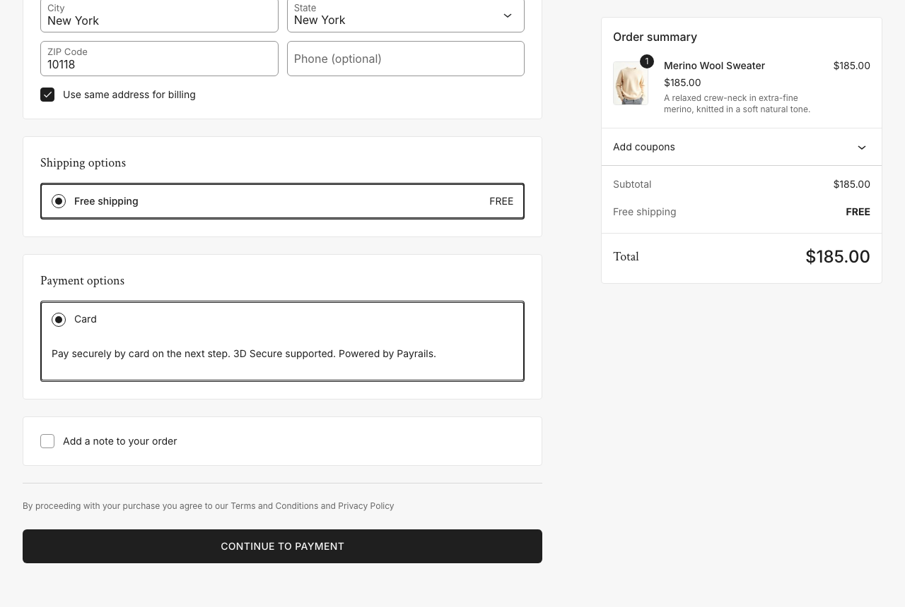
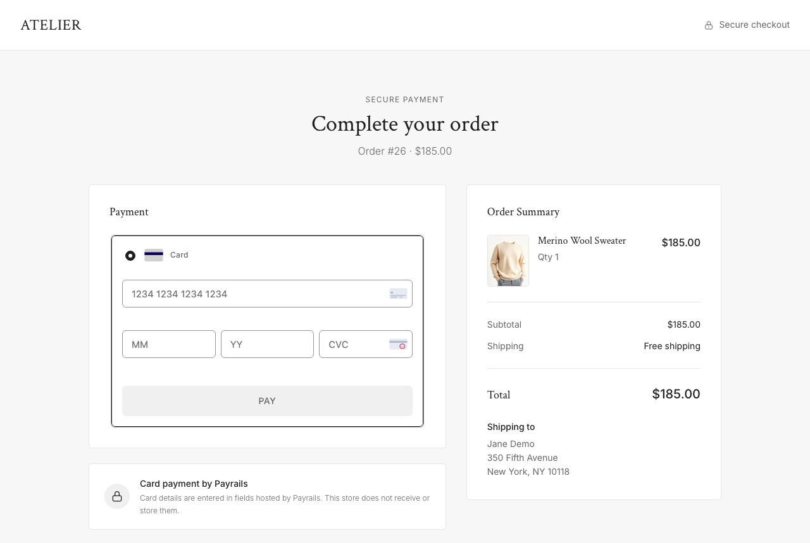
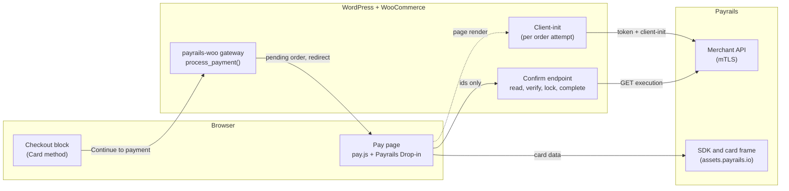

# Payrails × WooCommerce example

A reference integration of **Payrails card payments** into a **WooCommerce** store. The store is a small fictional shop called "Atelier". Card payments, including 3D Secure, run through the Payrails Web SDK Drop-in on WooCommerce's own pay-for-order page, and a WooCommerce payment gateway plugin verifies every payment on the server.

It shows:

- **A standard WooCommerce gateway.** It is built for the Checkout block, and the same gateway class serves the classic checkout. Place order creates a *pending* order, and the Payrails Drop-in mounts on the pay-for-order page.
- **Server-side Payrails calls.** Token and client-init calls run over mTLS, with one execution per order attempt and deterministic idempotency keys. Secrets never reach the database or the browser.
- **Server-side confirmation.** The browser only sends ids. The server reads the execution from Payrails, checks its reference, amount and currency against the order, and completes the order under a per-order lock, so it is completed exactly once.
- **The paths around the happy path.** 3D Secure challenges, declines with **Try again** on the same order, expired sessions, reloads, two open tabs, and safe error states when Payrails can't be reached.

| Storefront | Checkout block | Pay page with the Drop-in |
|---|---|---|
|  |  |  |

## How it fits together



The step-by-step walk through the code is in [docs/INTEGRATION_GUIDE.md](docs/INTEGRATION_GUIDE.md).

## Quickstart

**Requirements.** PHP 8.3 or later, WP-CLI, `curl`, `unzip`, `openssl` and `lsof`. Node 22 is needed for the browser tests only. There is no Docker or MySQL: `scripts/setup.sh` installs WordPress (6.6 or later; tested with 7.1.2) and WooCommerce (9.0 or later; tested with 11.1.2) on SQLite, and the store runs on PHP's built-in server. On macOS:

```bash
brew install php@8.3 wp-cli
```

Linux works too; see [docs/RUNNING_LOCALLY.md](docs/RUNNING_LOCALLY.md#requirements).

**Get the code** with git, so that the scripts keep their executable bits:

```bash
git clone <repository-url> payrails-woocommerce-example
cd payrails-woocommerce-example
```

**Credentials.** Ask Payrails for a **staging** setup:

- the staging **merchant API URL**;
- a client id and client secret;
- your **workspace id** (required);
- the **mTLS certificate and key**;
- a **workflow code with cards enabled**;
- `http://localhost:8080` as an allowed origin.

Then:

```bash
mkdir -p .secrets && chmod 700 .secrets
cp .secrets.example/payrails.env.example .secrets/payrails.env   # then fill in your values
cp /path/to/client.crt /path/to/client.key .secrets/
chmod 600 .secrets/*
```

`.secrets/` is gitignored. The plugin reads these values from the file or from `PAYRAILS_*` environment variables, never from the database.

**Install and start:**

```bash
scripts/setup.sh    # WordPress + WooCommerce on SQLite, plugin and theme linked in
scripts/seed.sh     # products, shipping, the "Card" payment method
scripts/start.sh    # http://localhost:8080
```

To use another port, `export PORT=8081` before running all three.

**First test payment:**

1. Open http://localhost:8080, add a product to the cart, and check out as a guest with any US address.
2. Click **Continue to payment**.
3. On the pay page, enter a test card for your staging workflow. With the processors most staging workflows use, `4242 4242 4242 4242` works. The Drop-in has separate month and year fields: enter `12` and `30`. Use CVC `123`.
4. You land on the order-received page. In **wp-admin > WooCommerce > Orders**, the order is *Processing*, and its transaction id is the Payrails execution id. The admin user name and password are in `.secrets/admin.txt`.

More test cards (3DS, decline), the demo click-path, the tests and troubleshooting are in [docs/RUNNING_LOCALLY.md](docs/RUNNING_LOCALLY.md).

## Where to look

Each step is marked in the code with `Payrails integration — step N`. Paths are relative to [`plugin/payrails-woo/`](plugin/payrails-woo/) unless they start with `theme/`.

| Step | What | Code (step markers) |
|---|---|---|
| 1 | Register the gateway and the Checkout-block method | [`assets/js/blocks.js:2`](plugin/payrails-woo/assets/js/blocks.js#L2), [`includes/Woo/Plugin.php:26`](plugin/payrails-woo/includes/Woo/Plugin.php#L26) |
| 2 | Place order: pending order, redirect to the pay-for-order page | [`includes/Woo/Gateway.php:150`](plugin/payrails-woo/includes/Woo/Gateway.php#L150) |
| 3 | Server auth: token + mTLS | [`includes/Core/Api/PayrailsClient.php:93`](plugin/payrails-woo/includes/Core/Api/PayrailsClient.php#L93), [`includes/Core/Http/CurlTransport.php:62`](plugin/payrails-woo/includes/Core/Http/CurlTransport.php#L62) |
| 4 | Client-init per order, with an idempotency key | [`includes/Core/Api/PayrailsClient.php:137`](plugin/payrails-woo/includes/Core/Api/PayrailsClient.php#L137), [`includes/Core/ClientInitBuilder.php:27`](plugin/payrails-woo/includes/Core/ClientInitBuilder.php#L27), [`includes/Woo/ExecutionSession.php:205`](plugin/payrails-woo/includes/Woo/ExecutionSession.php#L205) |
| 5 | Mount the Drop-in, handle success / failed / pending / sessionExpired | [`assets/js/pay.js:320`](plugin/payrails-woo/assets/js/pay.js#L320), [`includes/Woo/PayPage.php:251`](plugin/payrails-woo/includes/Woo/PayPage.php#L251), [`includes/Woo/PayPage.php:315`](plugin/payrails-woo/includes/Woo/PayPage.php#L315), [`theme/atelier/assets/payrails-appearance.json`](theme/atelier/assets/payrails-appearance.json) |
| 6 | Confirm server-side: read, verify, lock, complete | [`assets/js/pay.js:183`](plugin/payrails-woo/assets/js/pay.js#L183), [`includes/Woo/ConfirmController.php:25`](plugin/payrails-woo/includes/Woo/ConfirmController.php#L25), [`includes/Woo/ExecutionSession.php:246`](plugin/payrails-woo/includes/Woo/ExecutionSession.php#L246), [`includes/Core/ExecutionVerifier.php`](plugin/payrails-woo/includes/Core/ExecutionVerifier.php), [`includes/Core/ExecutionMapper.php`](plugin/payrails-woo/includes/Core/ExecutionMapper.php), [`includes/Woo/OrderLock.php`](plugin/payrails-woo/includes/Woo/OrderLock.php) |
| 7 | 3D Secure and retry after a decline | [`assets/js/pay.js:235`](plugin/payrails-woo/assets/js/pay.js#L235), [`assets/js/pay.js:389`](plugin/payrails-woo/assets/js/pay.js#L389), [`includes/Woo/ExecutionSession.php:421`](plugin/payrails-woo/includes/Woo/ExecutionSession.php#L421) |

## Repository layout

| Path | What |
|---|---|
| [`plugin/payrails-woo/`](plugin/payrails-woo/) | The gateway plugin. `includes/Core/` is plain PHP with no WordPress calls (API client, client-init builder, execution mapper and verifier). `includes/Woo/` is the WooCommerce glue. `assets/` holds `blocks.js`, `pay.js`, the baseline pay-panel CSS and the vendored SDK loader. `uninstall.php` cleans up on delete |
| [`theme/atelier/`](theme/atelier/) | The storefront theme (a Twenty Twenty-Five child theme). Its `assets/pay.css` sets the pay panel's brand tokens, and `assets/payrails-appearance.json` styles the card fields |
| [`theme/assets/products/`](theme/assets/products/) | Product data and images used by the seed |
| [`mu-plugin/`](mu-plugin/) | Small local hardening (XML-RPC off, no user enumeration) |
| [`scripts/`](scripts/) | Setup, seed, start, stop, reset, the PHP test runner and the local router |
| [`tests/`](tests/) | PHP unit and integration tests, fixtures, and Playwright end-to-end tests |
| [`.secrets.example/`](.secrets.example/) | The credentials template |

## Documentation

- [Integration guide](docs/INTEGRATION_GUIDE.md): the shopper's journey, step by step, with code excerpts and a sample client-init request and response
- [Architecture](docs/ARCHITECTURE.md): components, sequence diagram, order states, security model, SDK loading, filters, configuration, tests
- [Production checklist](docs/PRODUCTION_CHECKLIST.md): what this example deliberately doesn't do, what production needs, going live, and questions to settle with Payrails
- [Running locally](docs/RUNNING_LOCALLY.md): requirements, credentials, scripts, test cards, tests, troubleshooting

## Payrails documentation

- [Payrails documentation home](https://docs.payrails.com/)
- [Web SDK quick start](https://docs.payrails.com/docs/web-sdk-quick-start) and [Drop-in](https://docs.payrails.com/docs/drop-in)
- API reference: [client-init](https://docs.payrails.com/reference/clientinit) and [get an execution](https://docs.payrails.com/reference/getexecution)
- [mTLS configuration](https://docs.payrails.com/docs/mtls-configuration-1)
- [3D Secure](https://docs.payrails.com/docs/3d-secure)
- [Notifications](https://docs.payrails.com/docs/notifications) and [receiving them](https://docs.payrails.com/docs/receive-notifications)
- Payment operations: [capture](https://docs.payrails.com/docs/capture-a-payment), [refund](https://docs.payrails.com/docs/refund-a-payment) and [cancel](https://docs.payrails.com/docs/cancel-a-payment)
- [Executions](https://docs.payrails.com/docs/executions) and the [status codes reference](https://docs.payrails.com/docs/workflow-studio-status-codes)

## Status and scope

This is a **reference example on Payrails staging, not a production plugin.** It's meant to be read, run and adapted.

- It runs on PHP's built-in server with SQLite and plain HTTP.
- It accepts USD only.
- It shows cards only.
- It has no refund, capture or void calls, and no webhooks.
- It hasn't been hardened for hosting.

Use test cards only. Before building on it, read the [production checklist](docs/PRODUCTION_CHECKLIST.md).

### Support and maintenance

This repository is a learning reference, provided as is. It is not an officially supported Payrails product, it is not covered by any Payrails service agreement, and it may lag behind the latest Payrails SDK and API versions (it pins the Web SDK loader at 6.0.3). Don't deploy it unchanged.

For help with your own integration, contact your Payrails solutions engineer or Payrails support. The [Payrails documentation](#payrails-documentation) is the authoritative reference for API behavior.

## License

GPL-2.0-or-later; see [LICENSE](LICENSE). This matches the licensing of WordPress and WooCommerce. Third-party files keep their own licenses:

- the vendored Payrails Web SDK loader is MIT ([its `LICENSE`](plugin/payrails-woo/assets/vendor/payrails-web-sdk/6.0.3/LICENSE));
- the bundled fonts are under the SIL Open Font License ([`OFL-Inter.txt`](theme/atelier/assets/fonts/OFL-Inter.txt), [`OFL-CrimsonText.txt`](theme/atelier/assets/fonts/OFL-CrimsonText.txt)).
