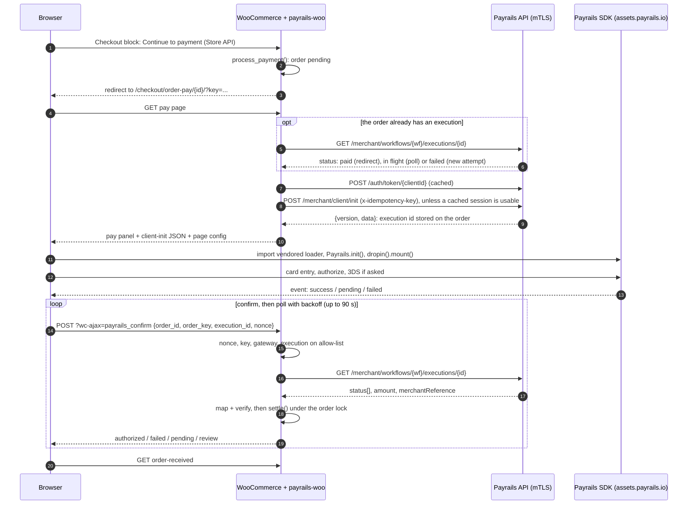

# Architecture

This page describes how the example is put together. For the step-by-step walk through the code, see [INTEGRATION_GUIDE.md](INTEGRATION_GUIDE.md).

## Components

| Component | Where | Role |
|---|---|---|
| Storefront | [`theme/atelier/`](../theme/atelier/) | A Twenty Twenty-Five child theme: templates, `theme.json`, the brand tokens for the pay panel (`assets/pay.css`) and the card-field appearance (`assets/payrails-appearance.json`) |
| Gateway plugin, Core | [`plugin/payrails-woo/includes/Core/`](../plugin/payrails-woo/includes/Core/) | Plain PHP with no WordPress calls: configuration, HTTP transport (cURL + mTLS), Payrails API client, client-init builder, execution mapper, verifier, confirm policy, holder references, money and UUID helpers |
| Gateway plugin, Woo | [`plugin/payrails-woo/includes/Woo/`](../plugin/payrails-woo/includes/Woo/) | The WooCommerce glue: gateway, Checkout-block integration, pay page, confirm endpoint, execution bookkeeping, order lock, logger, token cache |
| Browser code and styles | [`plugin/payrails-woo/assets/`](../plugin/payrails-woo/assets/) | `js/blocks.js` (the method in the Checkout block), `js/pay.js` (the pay-page controller), `css/payrails-woo.css` (the baseline pay-panel styles) |
| SDK loader | [`plugin/payrails-woo/assets/vendor/payrails-web-sdk/6.0.3/`](../plugin/payrails-woo/assets/vendor/payrails-web-sdk/6.0.3/) | The `@payrails/web-sdk` ESM loader, vendored with its license and checksums |
| Uninstall | [`plugin/payrails-woo/uninstall.php`](../plugin/payrails-woo/uninstall.php) | Removes the plugin's settings, install id, transients and lock rows. Keeps order data (execution ids and notes), which is part of the store's payment records |
| Local hardening | [`mu-plugin/atelier-hardening.php`](../mu-plugin/atelier-hardening.php) | XML-RPC off, no user enumeration for anonymous visitors |
| Local runtime | [`scripts/`](../scripts/) | WordPress on SQLite, run with PHP's built-in server. [`router.php`](../scripts/router.php) plays the web server's rewrite and deny rules |
| Payrails | the merchant API host for your environment (from Payrails), `assets.payrails.io` | The merchant API (server-to-server, mTLS) and the SDK runtime and secure card frame (browser) |

The Core/Woo split keeps the payment logic testable without WordPress. A unit test (`CoreIsolationTest`) fails if Core calls a WordPress function.

**Requirements.** PHP 8.3+, WordPress 6.6+ (the Atelier theme needs 6.7+), WooCommerce 9.0+. Tested with WordPress 7.1.2, WooCommerce 11.1.2, SQLite Database Integration 3.0.2 and Twenty Twenty-Five 1.5.

## Sequence



## Order states

| Order status | Reached when | What the pay page shows |
|---|---|---|
| *Pending payment* | `process_payment()` on Place order | The Drop-in |
| *Pending payment* (unchanged) | The execution is still pending, or Payrails is unreachable | "Confirming your payment", and the page polls |
| *Processing* | Authorized and verified: `payment_complete( $execution_id )` sets the transaction id and paid date, reduces stock and sends e-mails | Redirect to order-received |
| *Failed* | The latest terminal code of the latest attempt is a failure (a decline, a failed 3DS, a cancel or void) | "Payment declined" + **Try again** (a new execution on the same order) |
| *Processing* (from *Failed*) | A later attempt is authorized and verified | Redirect to order-received |
| *On hold* | Authorized, but reference, amount or currency doesn't match (`PR-VERIFY`) | "We couldn't verify this payment... Do not pay again." |

Two rules hold throughout:

- A paid order is never completed a second time.
- An execution that isn't provably this order's never changes it.

The plugin keeps its bookkeeping in order meta, which is safe with HPOS:

| Meta key | Holds |
|---|---|
| `_payrails_execution_id` | The current execution |
| `_payrails_execution_ids` | The allow-list: every execution created for the order |
| `_payrails_workflow_code` | The workflow the current execution runs in |
| `_payrails_fingerprint` | Amount, currency and workflow at init; a change forces a new client-init |
| `_payrails_attempt` | The attempt number used in the idempotency seed |
| `_payrails_failed_executions` | Declined executions already noted on the order (one note each) |
| `_payrails_extra_authorizations` | Other authorized executions found on an already-paid order (to void) |
| `_payrails_last_error` | The last public error code, so each error is noted once |
| `_payrails_holder_reference` | Guests only: the random holder reference for this order |

Logged-in customers' holder references live in **user meta** (`_payrails_holder_reference`), one per WordPress user.

## Security model

**The server is the only judge of payment outcomes.**

- The browser sends ids only: order id, order key, execution id and nonce.
- The server reads the execution from Payrails over mTLS and verifies that it belongs to this order: the id is on the allow-list, the reference matches, and the amount and currency match the current total.
- No browser input, event payload or query string can mark an order paid. The tampering tests check that: wrong key, another order's execution, a garbage id, a bad nonce, a client-sent `state=authorized`, and `GET`.

**Conservative mapping.**

- Only an exact `authorizeSuccessful` or `captureSuccessful` as the latest terminal code of the latest attempt counts as paid.
- A later cancel, void, reversal, refund or expiry means not paid.
- An unrecognized later code means pending, never paid.

**Who may ask about an order.**

- The order key in the URL is the authority, the same as for WooCommerce's own pay page. It is compared with `hash_equals`.
- The nonce is bound to the order id and adds CSRF protection.
- A browser can only name an execution that this server created for this order.

**One writer per order.** `ExecutionSession::settle()` is the only code that changes an order because of a Payrails result. It runs under a per-order lock (an `INSERT IGNORE` row with an owner token and a 120-second TTL), re-reads the order from the database, and never makes a network call while holding the lock. The integration test exercises this with stale renders and competing confirms.

**Card data** never reaches the store. The Drop-in's card fields are a Payrails iframe. The store sees only the execution id, codes and amounts.

**Holder references and stored cards.**

- Both kinds of holder reference are random, and neither contains personal data or internal ids.
- A logged-in customer has one per WordPress user, so stored cards follow the account.
- A guest gets a new one per order, never derived from the unverified e-mail, and the Drop-in shows guests no stored cards and no "save card" option.

**What reaches the browser.**

- The client-init response: a session payload scoped to one execution.
- Page configuration: URLs, order id and key, nonce, UI copy.
- Public error codes.

Never secrets, tokens or file paths. The authfail tests check the page HTML for the client secret and key material.

**Input handling.** Confirm inputs are sanitized and the execution id must match `^[A-Za-z0-9_-]{1,64}$`. The 3DS redirect URL is accepted only if it is `https` on `payrails.io`. The client IP is `REMOTE_ADDR` only, because forwarded headers can be spoofed.

The local runtime has its own guard rails (a deny list in `router.php`, a random admin password, `DISALLOW_FILE_EDIT`), but it isn't a hosting setup. See [PRODUCTION_CHECKLIST.md](PRODUCTION_CHECKLIST.md).

## SDK loading

`pay.js` is a classic deferred script. It loads the SDK with a dynamic `import()` of the vendored loader `assets/vendor/payrails-web-sdk/6.0.3/index.mjs`, which is the published `@payrails/web-sdk@6.0.3` ESM file.

The loader is small and self-contained. On `Payrails.init()` it loads the SDK runtime script and styles from `https://assets.payrails.io/web-sdk/`.

- **Which runtime.** By default the loader fetches the current runtime of its major version (v6), and the client-init response can select a specific runtime version. If you need the runtime pinned, ask Payrails.
- **Where the rest comes from.** The card fields come from a Payrails origin. 3DS challenge pages come from the card issuer.

**Why vendor the loader instead of loading it from a public CDN:**

- **An exact, pinned loader.** [`SHA256SUMS`](../plugin/payrails-woo/assets/vendor/payrails-web-sdk/6.0.3/SHA256SUMS) lets you verify it: `cd plugin/payrails-woo/assets/vendor/payrails-web-sdk/6.0.3 && shasum -a 256 -c SHA256SUMS`.
- **One less third-party origin** at runtime and in the Content Security Policy. `assets.payrails.io` is needed anyway.
- **No build step or package manager** in the WordPress install.

**To upgrade:**

1. Copy the new `index.mjs` and `LICENSE` into a new version folder.
2. Regenerate `SHA256SUMS`.
3. Change `PayPage::SDK_VERSION`.

The `payrails_woo_sdk_url` filter can point the page at another loader URL, for example `https://cdn.jsdelivr.net/npm/@payrails/web-sdk@6.0.3/index.mjs`.

If the loader or runtime can't load (offline, an ad blocker, a CSP), the page shows `PR-SDK-LOAD` or `PR-SDK-INIT`.

## Filters

| Filter | Default | Use |
|---|---|---|
| `payrails_woo_cards_only` | `true` | Hides wallet rows in the Drop-in and opens the Card method. It relies on Drop-in element ids; return `false` when your workflow only enables cards, or when you want wallets |
| `payrails_woo_order_description` | `Order #{number}` | The `meta.order.description` sent in client-init. Receives the description and the `WC_Order` |
| `payrails_woo_sdk_url` | the vendored loader | The URL `pay.js` imports the SDK loader from |
| `payrails_woo_http_transport` | `CurlTransport` | **Testing hook only**: replaces the HTTP transport (see below). Do not use it in production |

## Configuration and secrets

Secrets are never stored in the database and can't be edited in wp-admin. [`Core/Config.php`](../plugin/payrails-woo/includes/Core/Config.php) reads them from one of two sources:

1. **`PAYRAILS_*` environment variables.** These are used when the client id, secret, certificate path and key path are all set.
2. **Otherwise, an INI file** named by the `PAYRAILS_SECRETS_FILE` constant (or environment variable). `scripts/setup.sh` writes that constant into `wp-config.php` and points it at `.secrets/payrails.env`. In the file, relative certificate and key paths resolve against the file's own folder, and individual environment variables override single values.

| Key | Required | Notes |
|---|---|---|
| `PAYRAILS_CLIENT_ID` | yes | |
| `PAYRAILS_CLIENT_SECRET` | yes | Sent only as `x-api-key` to the token endpoint |
| `PAYRAILS_WORKSPACE_ID` | yes | Sent in client-init. A workspace-scoped client gets `401` from client-init without it, so the plugin treats it as required configuration: a missing value is reported as `PR-CONFIG` (admin notice, and the gateway is hidden at checkout) |
| `PAYRAILS_CERT_PATH`, `PAYRAILS_KEY_PATH` | yes | Paths to the mTLS PEM files. They must be readable |
| `PAYRAILS_API_URL` | yes | No default. Your Payrails contact provides the staging and production URLs. Must be `https://*.payrails.io` |
| `PAYRAILS_WORKFLOW_CODE` | no | Default `payment-acceptance`. The gateway settings can override it |

If the client id, secret, certificate or key is missing or unreadable, the gateway is hidden at checkout, an existing pay page shows `PR-CONFIG`, and an admin notice lists the missing key names.

**The settings page.** **WooCommerce > Settings > Payments > Payrails** shows the status (**Configured** or **Incomplete**), the API host and workflow, and whether each key is present and the certificate and key readable. It never shows values.

**Logging.** The logger writes to **WooCommerce > Status > Logs** (source `payrails-woo`):

- warnings and errors always;
- info lines only when the gateway's **Debug log** setting is on (off by default).

Log context is codes only: the public code, the Payrails error code for API errors, and for network errors just the cURL error number (cURL's error text can contain local file paths). It never contains values, tokens or exception messages.

**Redaction.** The `Config` object redacts itself in `var_dump`, `print_r`, `serialize` and `json_encode`.

**The token cache.** The access token is cached in a WordPress transient (`TransientTokenCache`). Without an object cache, that is a `wp_options` row. The `TokenCache` interface makes it a small swap for production.

## The test seam

All Payrails traffic goes through one interface, `Core\Http\HttpTransport`. In production that is `CurlTransport`.

The `payrails_woo_http_transport` filter in [`Woo/Services.php`](../plugin/payrails-woo/includes/Woo/Services.php) may return any other `HttpTransport`. The integration test uses it to inject a fake that answers like Payrails, so the whole order flow runs without network access or credentials:

```php
add_filter( 'payrails_woo_http_transport', static fn() => $transport );
```

The failure-path tests also need an API host that never resolves. `Config` accepts `*.payrails.invalid` hosts only when the `PAYRAILS_WOO_TESTING` constant is `true`. The repository's test scripts define it; the plugin never does. Without it, only `https://*.payrails.io` is accepted.

## Test strategy

| Layer | Command | What it covers | Network |
|---|---|---|---|
| Unit (PHPUnit 12, no WordPress) | `scripts/test-php.sh` | Client-init body and line splitting, IP-literal handling, token caching and the 401 retry key, idempotency keys, execution mapping (ordering by time, latest terminal code, later cancel or void, unknown codes, trailing pending after a decline), verifier rules, config loading, redaction and the test-host switch, holder references, money and UUID helpers, Core isolation. Fixtures in [`tests/php/fixtures/`](../tests/php/fixtures/) are responses observed on staging, with placeholder values | none |
| Integration (real WordPress + WooCommerce) | `scripts/test-php.sh --integration` | The order state machine through the test seam: success, replay, stale renders during a confirm (exactly one completion), lock ownership, second authorization on a paid order, holder references, decline then retry, pending, amount mismatch, total changed after init | none (a fake transport) |
| End-to-end, staging (Playwright) | `npm run test:e2e:staging` | Real browser, real Payrails staging, staging test cards: card, 3DS complete and fail, decline + retry, logged-in customer with a coupon, two tabs on one order, the pay page at 375 px, plus confirm-endpoint tampering | Payrails staging (about 8 test authorizations per run) |
| End-to-end, failure paths | `npm run test:e2e:authfail` | API unreachable (`PR-NET-*`) and secrets file missing (`PR-CONFIG`): a safe error, the order stays unpaid, no secrets in the HTML | none |

The e2e suite drives the same click-path a shopper would, then checks the order through WP-CLI: status, transaction id equal to the stored execution id, and note counts. See [RUNNING_LOCALLY.md](RUNNING_LOCALLY.md#running-the-tests) for how to run it.
